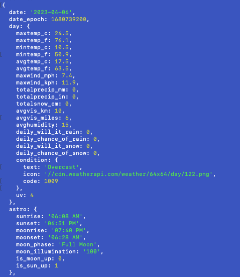
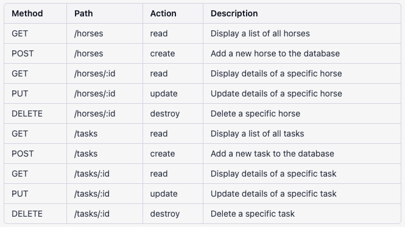
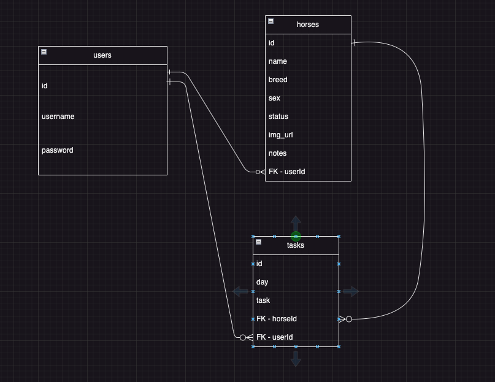
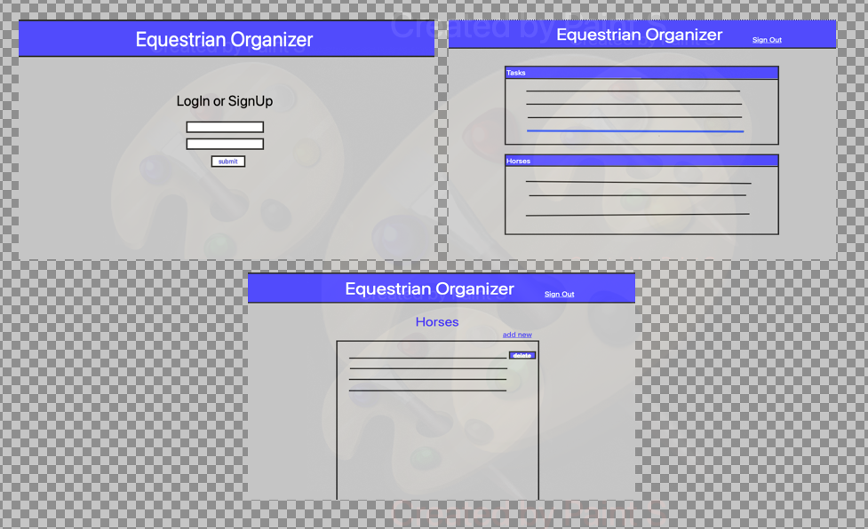

# Equestrian Organizer

## Keep Track of your horses
Equestrian Organizer is a simple and user-friendly application designed for equestrians to track and manage their horses. The app allows users to add, delete, and update horses, as well as assign tasks to individual horses or themselves. It provides an organized and efficient way for equestrians to manage their daily activities and horse-related responsibilities.

## API

Weather API - https://www.weatherapi.com
limits at 5,000,000 calls per month

---
## RESTful Routing Chart

---
## ERD

---
## Wireframe

---
## User Stories
* User needs to be able to create an account and log in so that they can have a personalized experience.
* User needs to be able to add a horse with basic information (name, breed, age, and picture) so that they can keep track of their horses.
* User needs to be able to delete a horse when it's no longer in their care or if they made a mistake when adding it.
* User needs to be able to view a list of my horses with their basic information so that they can have an overview of their horses.
* User needs to be able to assign tasks to their horses (e.g., grooming, feeding, exercise) with deadlines, so that they can manage their care efficiently.
* User needs to be able to view a list of tasks assigned to each horse so that they can easily see what needs to be done for each horse.
* User needs to be able to create tasks for themselves (e.g., buying horse feed, scheduling a vet appointment) so that they can stay organized.
* User needs to be able to view a list of my personal tasks so that they can manage their responsibilities effectively.
## MVP
* Simple display of sunrise and sunset on header for user convenience.
* User authentication and authorization (register, login, logout).
* CRUD operations for horses (add, edit, delete, view).
* CRUD operations for tasks (add, edit, delete, view).
* Assign tasks to horses or users.
* Responsive and user-friendly interface.
## Stretches
* Calendar view for tasks with reminders and notifications.
* Horse health tracking (vaccinations, vet visits, etc.).
* Advanced search and filtering options for horses and tasks.
* Upload personal photos of horse
* Set up a text reminding system(through twilio)
